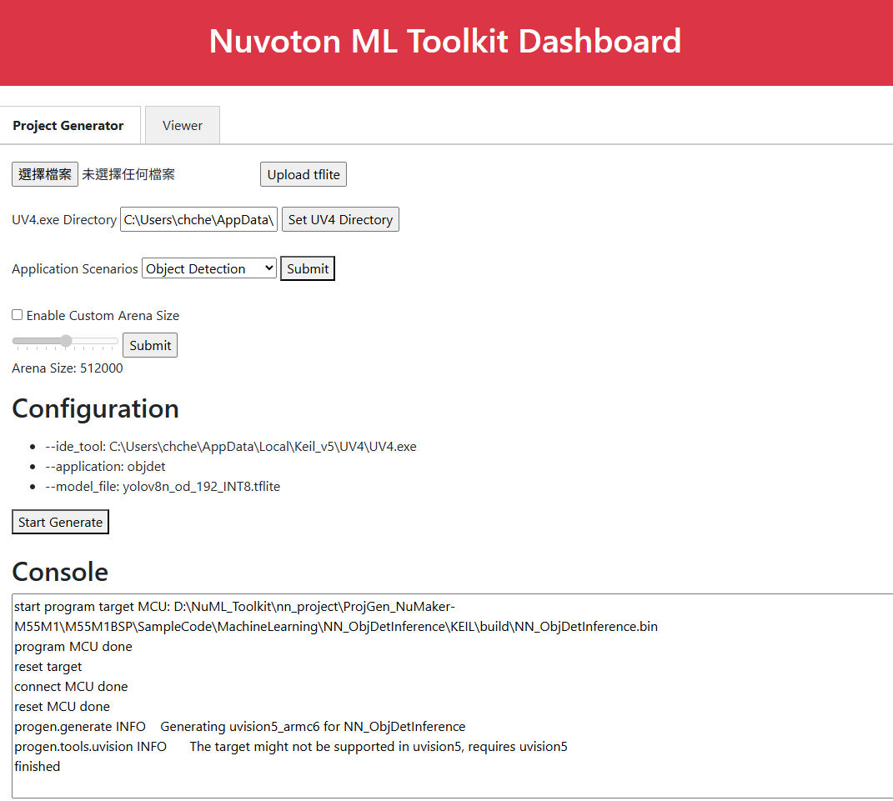
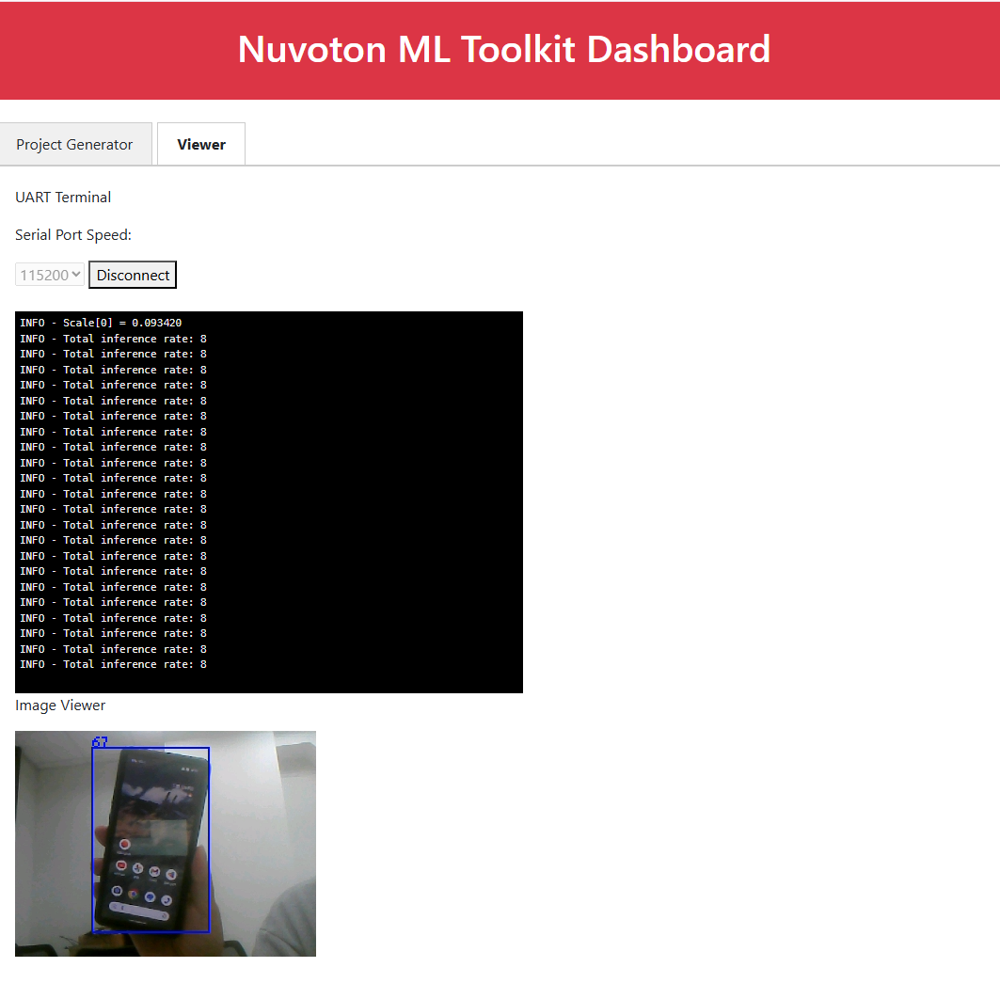

NuML_Dashboard
===
### Web GUI for NuML_TFLM_Tool.
## Support Features
* Project Generator: Configure parameters for NuML_TFLM_Tool deploy command. 
* Viewer: Quickly and easily inspect the results of model execution.
## Project Generator
* tflite uploader: Upload a quantized model to the default "models_upload" folder.
* UV4.exe directory: Set the path to Keil's UV4.exe. The default path is retrieved from the Windows registry.
* Application scenarios: Select an application scenarios.  
    * Generic: Only perform model inference without any pre/post-processing.
    * Image Classification: Suitable for MobileNetV2 application.
    * Object Detection: Suitable for YOLOv8n application.
* Arena size (optional): Customize the model's arena usage. Smaller value may degrade model execution efficiency.
## Viewer
* UART Terminal: Display the logs from target device.
* Image Viewer: Show the captured image. For UVC output applicatons (Image Classification, Object Detection).
## Run
1. Execute Dashboard.py
~~~
python Dashboard.py
~~~
2. Open a browser(Chrome/Edge) and go to http://127.0.0.1:5000

  
  
